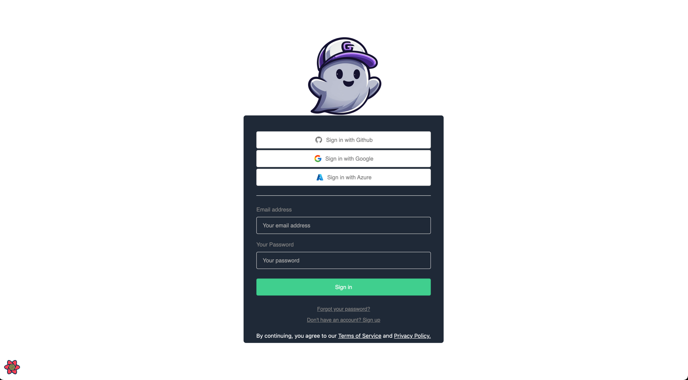
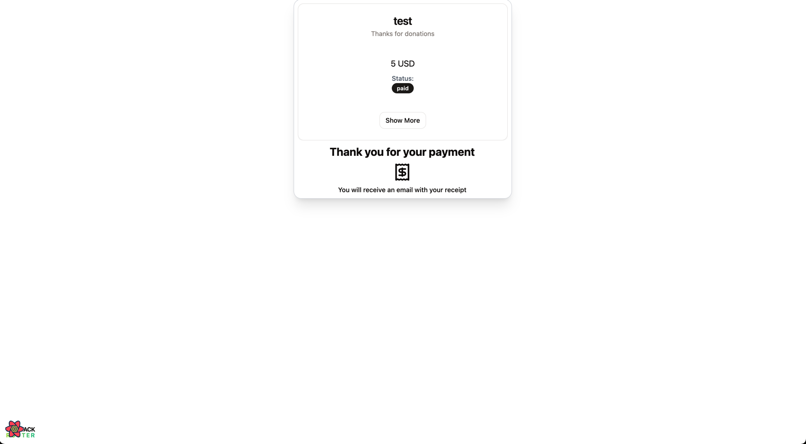

# Admin
## Admin Register

## Connect Wallet

## Generate Safe

## Create first store

## Dashboard

## Applications and integrations

## New invoice

## New donation page

## Sharing donation page with QR or URL

# Payment page

## Donations page

## Invoice page

### Invoice page - Pay with crypto

### Invoice page - Pay with crypto token list

### Invoice page - Pay with crypto token list - pay with any token

### Invoice page - Pay with crypto token list - GHO credit

### Invoice page - Pay with crypto token list - Payment done

# Example app - integration with SDK

## Init

## Usage

## Example UI

## Example UI - Embeded donation page

