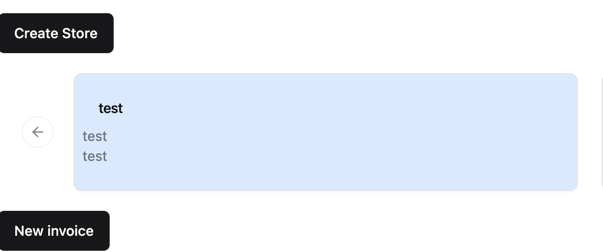
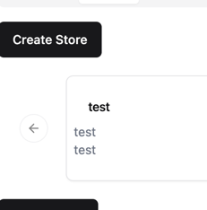

# Ghommerce - A simple web3 e-commerce platform built GHOO hackathon 

## TODO

Ayrton:
- dashboard redirect user to root if they don't have a wallet / store
- 
  - fix logged in user information
- add amounts to store card and a button for creating invoice 
  - 
- 
  - add a button to create a store

Kapy:
- Design and update the invoice page

Kristjan:
- handle the backend integration of paying invoices

