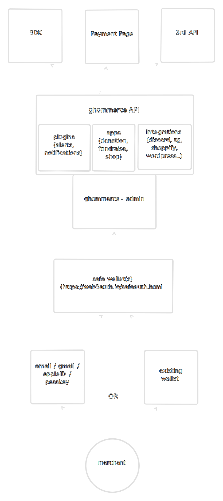

# Ghommerce - A simple web3 e-commerce platform built at GHOO hackathon
- https://ethglobal.com/events/lfgho

## Summary
Meet Ghommerce: A seamless e-commerce platform revolutionizing merchant transactions. Simplify payments with modular invoicing, versatile integrations, and our SDK. Empower customers to leverage crypto for credit, while merchants can invest earnings

## Problem

The classical e-commerce sector is struggling with several significant issues. 
 - high transaction fees, 
 - lengthy settlement times,
 - currency conversion

**These issues drastically burden both merchants and customers.** 

Furthermore, the practical integration of cryptocurrencies with e-commerce platforms often remains a complex task.
Merchants are faced with a variety of challenges, including:
  - complex integrations, requiring deep technical knowledge 
  - lack of customized payment options

Consumers, on the other hand:
  - are often limited to a single payment option, restricting their financial flexibility. 
  - find their ability to leverage digital assets within an e-commerce context considerably limited, restricting their financial flexibility.  

Lastly, the prevalent norm of e-commerce platforms acting as custodial entities raises critical trust issues.  
**The inherent lack of financial autonomy negates the core advantage of decentralization, emphasizing the urgent need for a genuinely distributed, blockchain-centric solution effective enough to create a seamless web3 e-commerce environment.**  

## Product

Ghommerce represents a groundbreaking evolution in e-commerce, merging the autonomy of open-source software with the cutting-edge features of web3 technology.   
It simplifies transactions for merchants through account abstraction, allowing them to focus on their businesses without getting entangled in the complexities of blockchain.  

The platform is incredibly user-centric:
**For merchants, it offers a variety of benefits, including:**
- a simple, intuitive interface
- dynamically supporting multiple tokens for payments
- a comprehensive SDK for easy integration with their existing systems
- a plugin system for advanced customization
- a robust analytics system for detailed insights into their business
- merchants can automatically invest their earnings through the platform, potentially increasing their income and engaging more deeply with the crypto financial products.

For customers it offers:
- **Ghommerce offers the chance to leverage crypto holdings for credit**, providing financial flexibility and broadening the customer base for merchants. 
- pay with any token, allowing them to use their preferred digital assets for transactions.
- pay with multiple tokens, allowing them to use their preferred digital assets for transactions.
- option to pay with fiat, connecting the traditional financial system with the crypto world.
- optimized for mobile, allowing customers to shop on the go
- optimized transaction fees, ensuring the lowest possible costs for customers

The platform stands out by never holding funds, prioritizing financial autonomy and security. Its architecture is inherently scalable, supporting multiple merchants and shops from a single installation. With a robust plugin system and comprehensive SDK, Ghommerce invites customization and extension, allowing users to integrate advanced analytics, tailor payment workflows, or add unique marketing tools.

Its scalability is further enhanced by the option for merchants to either self-host for full control or opt for a managed cloud instance, ensuring that the platform can adapt to the size and scope of any business.

In essence, Ghommerce is not just a payment platform; it's a comprehensive, versatile, secure, and user-friendly financial ecosystem designed to meet the evolving needs of merchants and customers in the dynamic digital age, setting a new standard for business and customer interactions.

## Architecture

