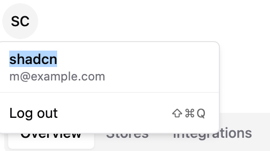

# Ghommerce - A simple web3 e-commerce platform built at GHOO hackathon
- https://ethglobal.com/events/lfgho

## Summary
Meet Ghommerce: A seamless e-commerce platform revolutionizing merchant transactions with account abstraction. Simplify payments with modular invoicing, versatile integrations, and our SDK. Empower customers to leverage crypto for credit, while merchants can invest earnings

## Problem

The e-commerce sector is struggling with several significant issues. High transaction fees, lengthy settlement times, and cross-border payment issues drastically burden both merchants and customers.  

Furthermore, the practical integration of cryptocurrencies with e-commerce platforms often remains a complex task. This complexity necessitates a steep learning curve from customers and deep technical proficiency from merchants, acting as a firm barrier against widespread crypto adoption.  

Numerous businesses are forced to compromise their preferred operational models due to the lack of versatile invoicing systems and customized payment solutions. Similarly, consumers find their ability to leverage digital assets within an e-commerce context considerably limited, restricting their financial flexibility.  

Lastly, the prevalent norm of e-commerce platforms acting as custodial entities raises critical trust issues. The inherent lack of financial autonomy negates the core advantage of decentralization, emphasizing the urgent need for a genuinely decentralized, blockchain-centric solution effective enough to create a seamless web3 e-commerce environment.  

## Product

Ghommerce represents a groundbreaking evolution in e-commerce, merging the autonomy of open-source software with the cutting-edge features of web3 technology. It simplifies transactions for merchants through account abstraction, allowing them to focus on their businesses without getting entangled in the complexities of blockchain. The platform is incredibly user-centric, supporting multiple tokens for payments, enabling customers to use their preferred cryptocurrency, and allowing merchants to receive their desired currency.

Ghommerce's modular invoicing system is designed for flexibility, catering to various business needs such as subscription services, one-time payments, or bespoke payment solutions. Its scalability is further enhanced by the option for merchants to either self-host for full control or opt for a managed cloud instance, ensuring that the platform can adapt to the size and scope of any business.

For customers, Ghommerce offers the chance to leverage crypto holdings for credit, providing financial flexibility and broadening the customer base for merchants. Additionally, merchants can automatically invest their earnings through the platform, potentially increasing their income and engaging more deeply with the crypto financial products.

The platform stands out by never holding funds, prioritizing financial autonomy and security. Its architecture is inherently scalable, supporting multiple merchants and shops from a single installation. With a robust plugin system and comprehensive SDK, Ghommerce invites customization and extension, allowing users to integrate advanced analytics, tailor payment workflows, or add unique marketing tools.

In essence, Ghommerce is not just a payment platform; it's a comprehensive, versatile, secure, and user-friendly financial ecosystem designed to meet the evolving needs of merchants and customers in the dynamic digital age, setting a new standard for business and customer interactions.

## Architecture

