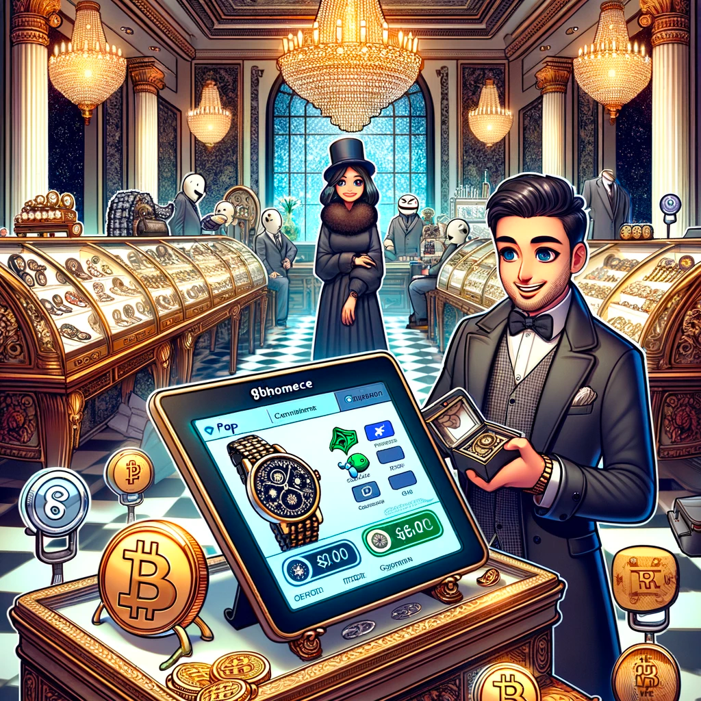

# Ghommerce: making web3 e-commerce simpler 

## 📖 Storytime

To better imagine the use case, let's take a look at some possible scenarios where Ghommerce can be used.

### Example1: Empowering Voices in the Face of Censorship 🤬
In a nation gripped by censorship, a political activist fights to make his voice heard. Operating under constant threat, his lifeline is a vibrant Telegram channel, a beacon for those seeking truth amidst the fog of propaganda. 
Yet, sustaining this beacon requires funds—funds that are perilously exposed to the prying eyes and iron fists of authoritarian oversight.  

  

Enter GHOmmerce. Integrating this platform, the activist connects and safely monetizes his audience opening a new chapter of resilience.  
His donations and payments, converted into an array of digital assets, are now beyond the reach of censorship.

### Example2: Indulging in Luxury with the Whims of the Market 💎
Picture a high-end boutique, an emporium of luxury watches, each timepiece a testament to craftsmanship and opulence.  
Yet, in a digital era, the clientele's wealth is not just in vaults, but also in bytes—cryptocurrency, a volatile ocean of digital assets, some as whimsical as the PEPE token.

For a discerning merchant, adapting to this new age of affluence is pivotal. By integrating Ghommerce, the boutique not only embraces the future but also captivates a new breed of customers.

One such customer, riding the crest of a meme token surge, finds himself on the boutique's digital storefront. The sight of exquisite timepieces, now within reach through his digital fortune, is irresistible.  
With a few clicks, his PEPE tokens, once a speculative punt are now converted into a luxury watch, a tangible symbol of his success.
The merchant, in turn, receives his payment in a token of his choice, and can even opt to invest it in a crypto financial product, potentially increasing his earnings even further.  

> _These stories encapsulate the essence of Ghommerce, illustrating its potential to not just facilitate transactions, but to empower, adapt, and redefine the way we perceive value and freedom in a rapidly evolving digital landscape._

## Summary
Meet Ghommerce: A seamless e-commerce platform revolutionizing merchant transactions. Simplify payments with modular invoicing, versatile integrations, and our SDK. Empower customers to leverage crypto for credit, while merchants can invest earnings  

## Problem

The classical e-commerce sector is struggling with several significant issues. 
 - high transaction fees, 
 - lengthy settlement times,
 - currency conversion

**These issues drastically burden both merchants and customers.** 

Furthermore, the practical integration of cryptocurrencies with e-commerce platforms often remains a complex task.
Merchants are faced with a variety of challenges, including:
  - complex integrations, requiring deep technical knowledge 
  - lack of customized payment options

Consumers, on the other hand:
  - are often limited to a single payment option, restricting their financial flexibility. 
  - find their ability to leverage digital assets within an e-commerce context considerably limited, restricting their financial flexibility.  

Lastly, the prevalent norm of e-commerce platforms acting as custodial entities raises critical trust issues.  
**The inherent lack of financial autonomy negates the core advantage of decentralization, emphasizing the urgent need for a genuinely distributed, blockchain-centric solution effective enough to create a seamless web3 e-commerce environment.**  

## Product

Ghommerce represents a groundbreaking evolution in e-commerce, merging the autonomy of open-source software with the cutting-edge features of web3 technology.   
It simplifies transactions for merchants through account abstraction, allowing them to focus on their businesses without getting entangled in the complexities of blockchain.  

The platform is incredibly user-centric:
**For merchants, it offers a variety of benefits, including:**
- a simple, intuitive interface
- dynamically supporting multiple tokens for payments
- a comprehensive SDK for easy integration with their existing systems
- a plugin system for advanced customization
- a robust analytics system for detailed insights into their business
- merchants can automatically invest their earnings through the platform, potentially increasing their income and engaging more deeply with the crypto financial products.

For customers it offers:
- **Ghommerce offers the chance to leverage crypto holdings for credit**, providing financial flexibility and broadening the customer base for merchants. 
- pay with any token, allowing them to use their preferred digital assets for transactions.
- pay with multiple tokens, allowing them to use their preferred digital assets for transactions.
- option to pay with fiat, connecting the traditional financial system with the crypto world.
- optimized for mobile, allowing customers to shop on the go
- optimized transaction fees, ensuring the lowest possible costs for customers

The platform stands out by never holding funds, prioritizing financial autonomy and security. Its architecture is inherently scalable, supporting multiple merchants and shops from a single installation. With a robust plugin system and comprehensive SDK, Ghommerce invites customization and extension, allowing users to integrate advanced analytics, tailor payment workflows, or add unique marketing tools.

Its scalability is further enhanced by the option for merchants to either self-host for full control or opt for a managed cloud instance, ensuring that the platform can adapt to the size and scope of any business.

In essence, Ghommerce is not just a payment platform; it's a comprehensive, versatile, secure, and user-friendly financial ecosystem designed to meet the evolving needs of merchants and customers in the dynamic digital age, setting a new standard for business and customer interactions.

## Architecture

## Tech Stack

- apps:
  - api (merchant + customer) [apps/api](apps/api)
    - supabase (postgres + auth) and bun for backend logic
      - api is only used for providing various data to the frontend and store management, notifications, analytics, etc.
      - at no point it has access to the merchant's private key or funds
  - admin page (merchant) [apps/admin](apps/admin)
    - vite, react, tailwind, tanstack router, zustand, react-query
    - Merchant can connect their existing wallet, or use web3auth to create a new one, then a https://safe.global/ is created for them, and they can use to receive payments
  - public payment page (customer) [apps/ghommerce](apps/ghommerce)
    - vite, react, tailwind, tanstack router, zustand, react-query
    - Customer connects their wallet using [ConnectKit](https://docs.family.co/connectkit/getting-started) and can pay with any token they have in their wallet
  - sdk to integrate payment page as a widget [packages/sdk](packages/sdk)
    - typescript browser sdk
  - example-app to demonstrate sdk usage [apps/example](apps/example)
    - https://github.com/grmkris/eth-global-lfgho-ghommerce/blob/994775f3fd1baaa2675b2e735ca27b7aa0eeb7ed/apps/example/src/useGhommerceSDK.tsx#L2-L2
